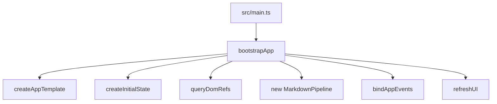
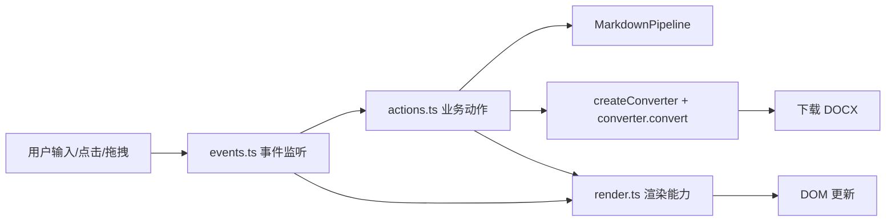
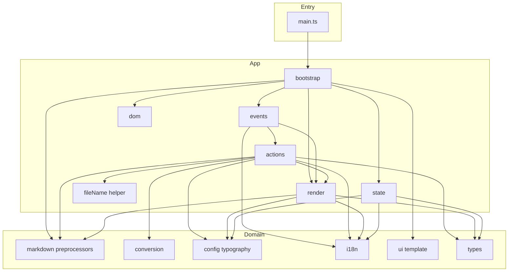

# BAT 架构说明

本文档描述当前前端工程的分层结构、调用流与依赖方向，目标是在保持功能行为稳定的前提下，降低耦合并提升可维护性。

## 1. 设计目标

- 单一职责：每个模块只处理一种变化来源。
- 单向依赖：上层编排下层能力，下层不反向依赖上层。
- 可替换性：UI、状态、动作、转换链路可独立演进。
- 功能等价：重构不改变用户功能和转换结果。

## 2. 目录与职责

### 2.1 入口层

- src/main.ts
  - 仅负责样式导入与应用启动。
  - 不承载业务逻辑。

### 2.2 应用编排层（src/app）

- src/app/bootstrap.ts
  - 装配应用：初始化模板、状态、DOM 引用、事件、首次渲染。
- src/app/state.ts
  - 定义 AppState 与初始状态创建。
- src/app/dom.ts
  - 集中查询并缓存页面长期 DOM 引用。
- src/app/render.ts
  - UI 渲染、文案刷新、主题应用、状态提示、预览渲染。
- src/app/actions.ts
  - 用户动作实现：读文件、清空、粘贴、转换、字号持久化。
- src/app/events.ts
  - 统一事件绑定，把 DOM 事件映射到 actions/render。
- src/app/helpers/fileName.ts
  - 导出文件名生成与规范化辅助。

### 2.3 领域能力层

- src/markdown/preprocessors.ts
  - Markdown 预处理流水线。
  - 提供 forPreview 与 forDocx 两套处理入口。
- src/conversion/converters.ts
  - Docx 构建与下载编排。
  - 包含数学 OMML 注入、排版大小规范化等逻辑。
- src/conversion/nativeMath.ts
  - LaTeX 与 OMML token 处理、TeX -> OMML 转换。
- src/conversion/latexPreprocessor.ts
  - TeX 表达式预清洗规则。
- src/conversion/ommlPostprocess.ts
  - OMML 结构后处理与兼容增强。
- src/config/typography.ts
  - 字号配置默认值、归一化、读写存储。
- src/i18n.ts
  - 多语言字典与文本获取。
- src/ui/template.ts
  - 页面模板字符串。
- src/types.ts
  - 跨层共享类型定义。

## 3. 启动调用流

说明：
- main 只触发 bootstrap，不关心业务细节。
- bootstrap 只做装配，不直接实现业务动作。

## 4. 用户交互调用流

说明：
- 事件层只负责分发，不持有复杂业务。
- 动作层执行真正业务并复用 render 反馈状态。

## 5. 依赖方向（单向）

依赖约束：
- App 层可以依赖 Domain 层。
- Domain 层禁止依赖 App 层。
- Entry 层只依赖 App 启动模块。

## 6. 核心稳定点（重构后需持续保持）

- 转换顺序保持：Markdown 预处理 -> 转换器执行 -> 下载。
- UI 状态源保持：AppState 作为运行时单一状态入口。
- 事件入口保持：所有交互统一在 events 绑定。
- 文案刷新保持：语言切换时由 refreshUI 集中刷新。

## 7. 后续扩展建议

- 新增功能优先落在 actions，避免回流到 events/render。
- 新增页面元素先扩展 dom.ts，再在 render/events 接入。
- 新增转换规则优先进入 markdown 或 conversion，不进入 app 层。
- 若后续模块继续增长，可在 src/app 下增加子目录（rendering、interaction、state）。
